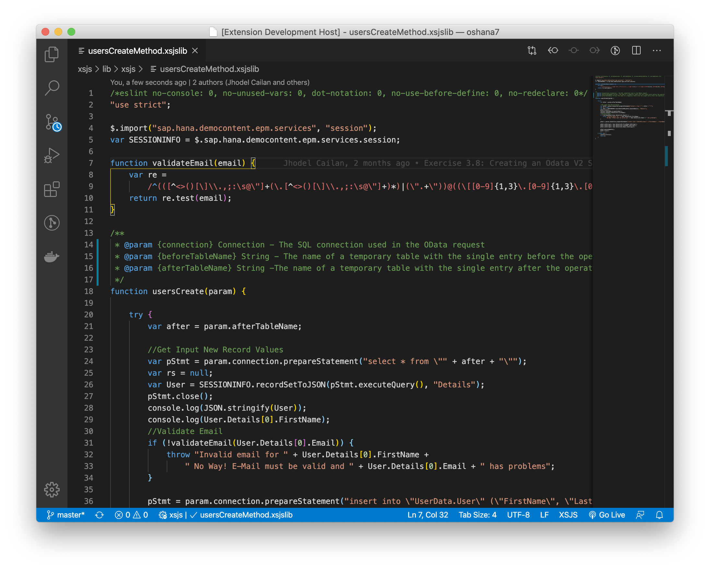

      

# Deprecation Notice!!

> This VS Code extension is already being discontinued. To give way for a broader aspect of development tooling support for SAP.  I have created a new VS Code extension called [Blue Phoenix](https://marketplace.visualstudio.com/items?itemName=jhodel.blue-phoenix) that will focus on a broader aspect of tooling around the Cloud Application Programming Model (CAP).

# SAP XSJS Language Support for Visual Studio Code

This is an XSJS syntax highlighting extension for Visual Studio Code.  Based on the JavaScript syntax.

## Sample

**Enjoy!**
